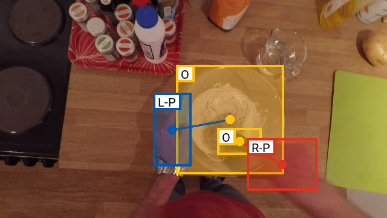
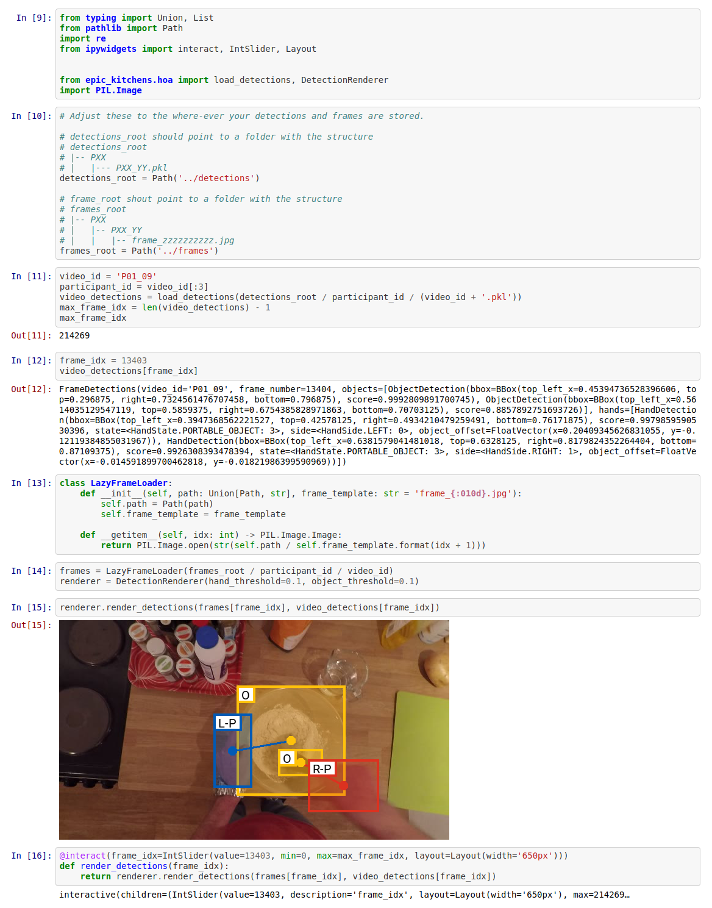

# EPIC-KITCHENS-100 Hand-object detections
[](https://epic-hand-object-detections.readthedocs.io/en/latest/?badge=latest)

This repository contains a supporting library for using the hand-object
detections we extracted from
[ddshan/Hand_Object_Detector](https://github.com/ddshan/Hand_Object_Detector)
([CVPR
2020](https://openaccess.thecvf.com/content_CVPR_2020/html/Shan_Understanding_Human_Hands_in_Contact_at_Internet_Scale_CVPR_2020_paper.html)).



Check out the [notebook](./notebooks/demo.ipynb) for usage:

[](./notebooks/demo.ipynb)

## Library

This repository contains supporting code for using hand-object detections which are
stored in binary protobuf files. The schema can be found in [`src/public_lib
/epic_kitchens/hoa/types.proto`](./src/public_lib/epic_kitchens/hoa/types.proto).

Install the library like so:

```console
$ python setup.py install
```

To hack on it, just install with

```console
$ python setup.py develop
```

and edit the files within the repo.

## Downloads

We provide the detections for all frames in EPIC Kitchens. These are avaiable to
download from [data.bris](https://data.bris.ac.uk/data/dataset/3l8eci2oqgst92n14w2yqi5ytu).

Please manually download the detections for P27_103 and P01_109 from
- https://www.dropbox.com/s/fjvhpd4o9l2n08y/P01_109.pkl?dl=0
- https://www.dropbox.com/s/ocvy4fskv9j8xmt/P27_103.pkl?dl=0

The ones on data.bris were incorrectly extracted.

---

## Model setup

We ran the code with
- weights: https://drive.google.com/open?id=1H2tWsZkS7tDF8q1-jdjx6V9XrK25EDbE
- hand threshold: 0.1
- object threshold: 0.01

We opted for lower hand and object thresholds than have been judged optimal, this is so 
that you, as a user, can decide what threshold (down to those that we extracted features
at) to use for objects and hands without having to re-extract detections on the whole 
dataset.

We have found the following settings to produce good qualitative results:
- hand threshold: 0.5
- object threshold: 0.5
 
 
## Processing raw detections

The raw detections follow a different schema to those that we release. We simply
persist the raw hand and object detections without any preprocessing in case we
need to apply any corrective post-processing.

Subsequently we need to convert these into the schema that we release in.

A [`Snakefile`](./Snakefile) is provided for use with [`snakemake`](https://snakemake.readthedocs.io/en/stable/). 
This handles:

1. aggregating per-frame extractions into per-video extractions
2. converting the raw detections to the public detection schema.

The scripts that are used to perform these tasks live in `src/scripts`.
